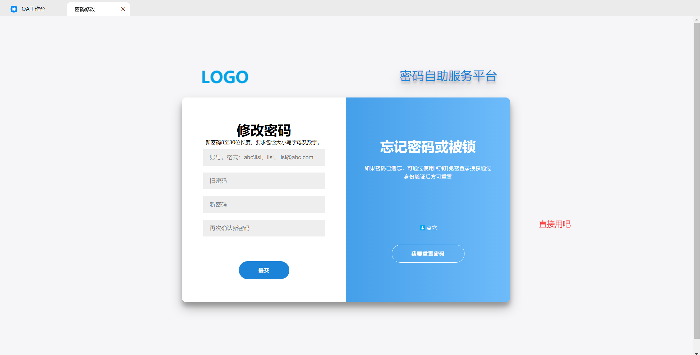
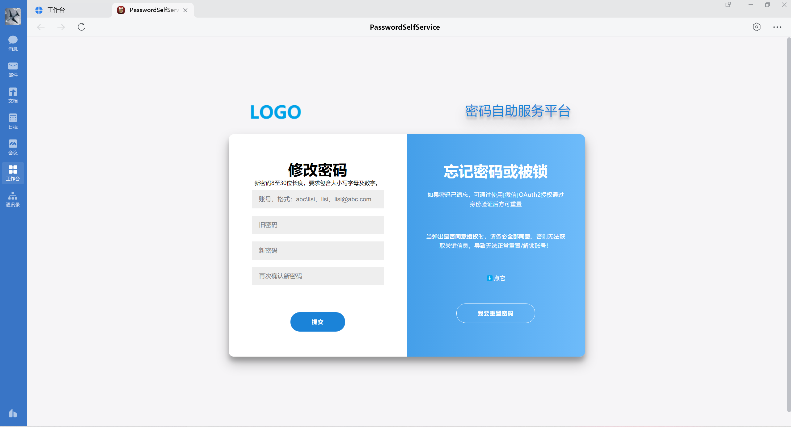
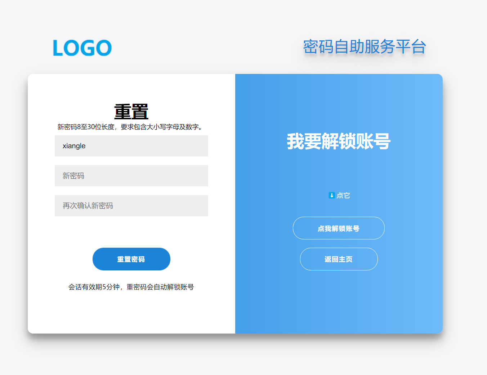
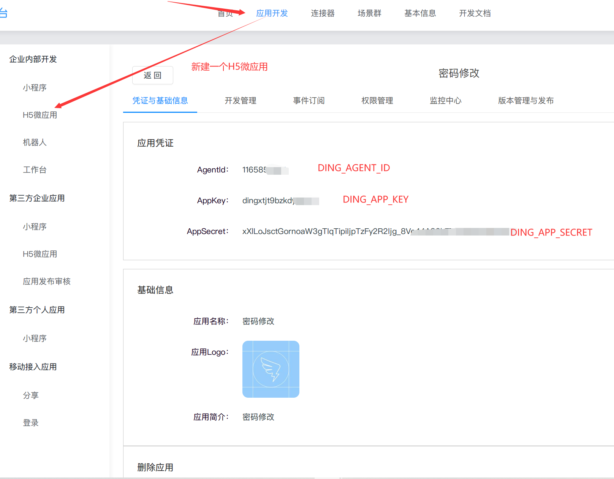
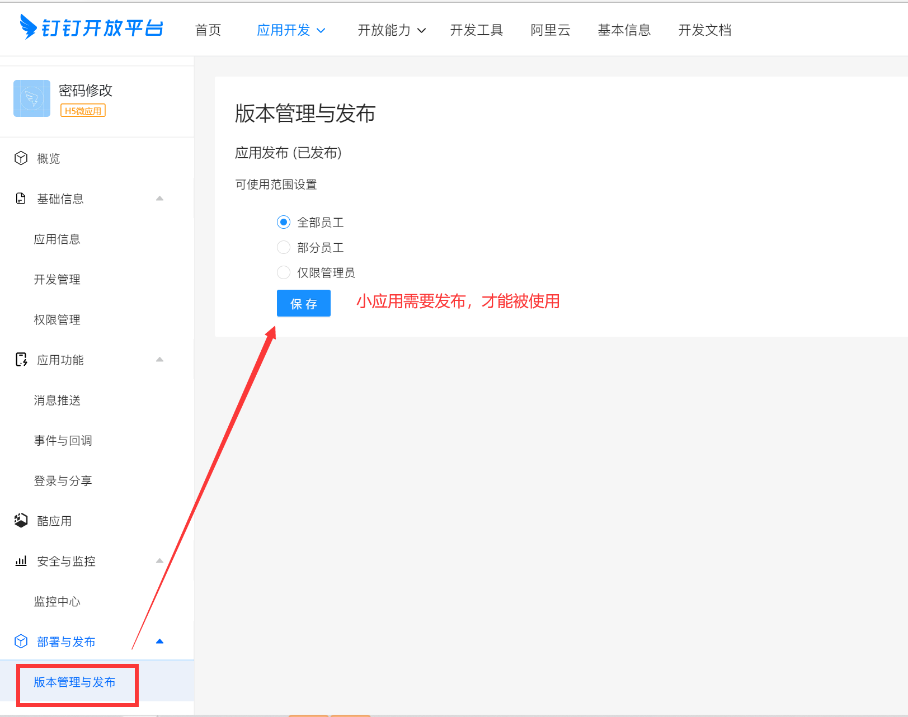
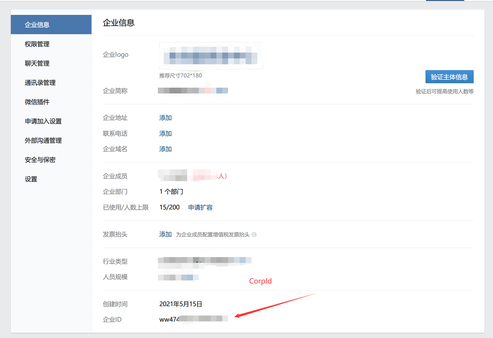
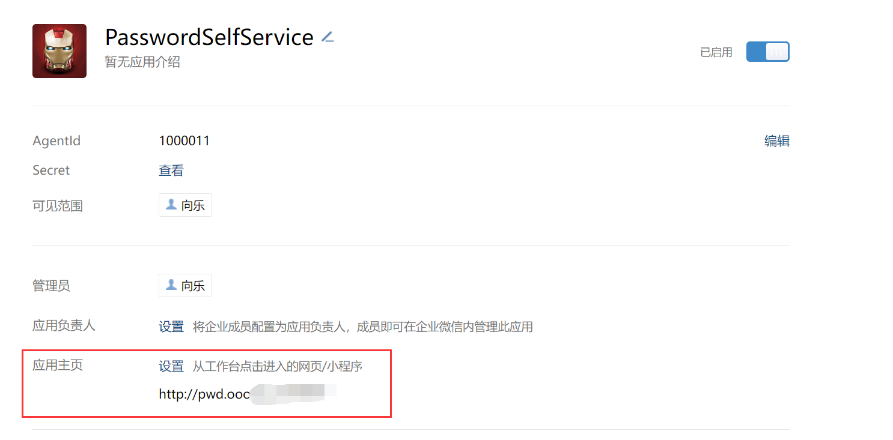
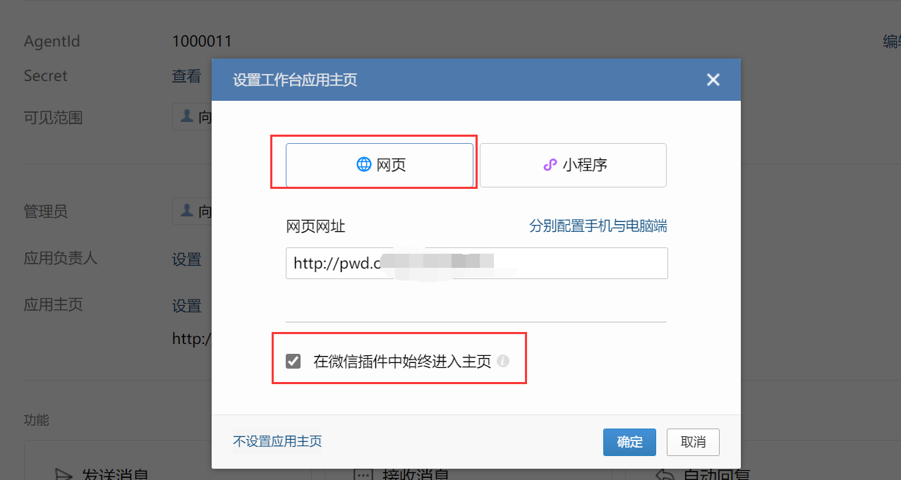
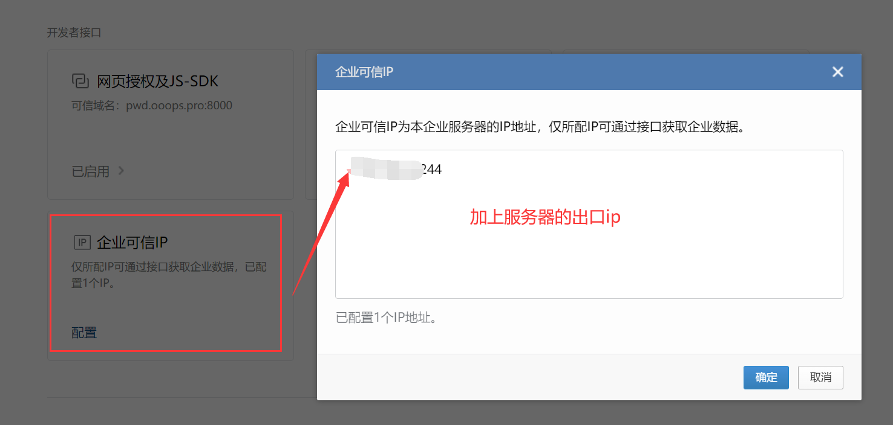

### 初学Django时碰到的一个需求，因为公司中很多员工在修改密码之后，有一些关联的客户端或网页中的旧密码没有更新，导致密码在尝试多次之后账号被锁，为了减少这种让人头疼的重置解锁密码的操蛋工作，自己做了一个自助修改小平台。  
### 水平有限，代码写得不好，但是能用，有需要的可以直接拿去用。
#### 场景说明：
因为本公司AD是早期已经在用，用户的个人信息不是十分全面，例如:用户手机号。  
钉钉是后来才开始使用，钉钉默认是使用手机号登录。
用户自行重置密码时如果通过手机号来进行钉钉与AD之间的验证就行不通了。 


### 逻辑：
>已经与之前不同，现在改成内嵌小应用，不再支持直接通过网页开始，之前的扫码方式有点多此一举的味道。

 ## <u>_**所能接受的账号规则**_ </u>
无论是钉钉、微信，均是通过提取用户邮箱的前缀部分来作为关联AD的账号，所以目前的识别逻辑就需要保证邮箱的前缀和AD的登录账号是一致的。
如果您的场景不是这样，请按自己的需求修改源代码适配。


### 代码提交到：
```
master
```

### 提示：
```
AD必须使用SSL才能修改密码（这里被坑了N久...）
自行部署下AD的证书服务，并颁发CA证书，重启服务器生效。
具体教程百度一下，有很多。
```

### 本次升级、修复，请使用最新版：
+ 升级Python版本为3.8
+ 升级Django到3.2
+ 修复用户名中使用\被转义的问题
+ 重写了dingding模块，因为dingding开发者平台接口鉴权的一些变动，之前的一些接口不能再使用，本次重写。
+ 重写了ad模块，修改账号的一些判断逻辑。
+ 重写了用户账号的格式兼容，现在用户账号可以兼容：username、DOMAIN\username、username@abc.com这三种格式。
+ 优化了整体的代码逻辑，去掉一些冗余重复的代码。

### 2022/12/16 -- 更新：
+ 修改钉钉、企业微信直接通过企业内部免密登录授权或验证的方式实现用户信息的获取，直接通过软件内部工作平台打开，废弃扫码方式（由于API接口的权限问题，一些关键数据已经不再支持通过扫码获取）

其它没变化，只修复了这个问题~~~~

## 线上环境需要的基础环境：
+ Python 3.8.9 (可自行下载源码包放到项目目录下，使用一键安装)
+ Nginx
+ Uwsgi

### 钉钉


### 微信



#### 授权或验证成功之后：



## 钉钉必要条件：
#### 创建企业内部应用
* 在钉钉工作台中通过“自建应用”创建应用，选择“企业内部开发”，创建H5微应用，在应用首页中获取应用的：AgentId、AppKey、AppSecret。
* 应用需要权限：通讯录只读权限、邮箱等个人信息，范围是全部员工或自行选择
* 应用安全域名和IP一定要配置，否则无法返回接口数据。

参考截图配置：





#### 移动接入应用--登录权限：
> 废弃，已经不再需要，如果之前有配置，可以删除！！


## 企业微信必要条件：
* 创建应用，记录下企业的CorpId，应用的ID和Secret。

参考截图：










## 飞书必要条件：
 * 暂时没时间，做不了，已经剔除了！

## 如果你觉得这个小工具对你有帮忙的话，可以请我喝杯咖啡~😁😁😁


## 使用脚本自动部署：
使用脚本自动快速部署，只适合Centos，其它发行版本的Linux请自行修改相关命令。


### 把整个项目目录上传到新的服务器上

#### 先修改配置文件，按自己实际的配置修改项目配置文件：
修改conf/local_settings.py中的参数，按自己的实际参数修改
```` python
# ########## AD配置，修改为自己的
# AD主机，可以是IP或主机域名，例如可以是: abc.com或172.16.122.1
AD_HOST = r'修改成自己的'

# AD域控的DOMAIN名，例如：abc
AD_DOMAIN = r'修改成自己的'

# 用于登录AD做用户信息处理的账号，需要有修改用户账号密码或信息的权限。
# AD账号，例如：pwdadmin
AD_LOGIN_USER = r'修改成自己的'
# 密码
AD_LOGIN_USER_PWD = r'修改为自己的'

# BASE DN，账号的查找DN路径，例如：'DC=abc,DC=com'，可以指定到OU之下，例如：'OU=RD,DC=abc,DC=com'。
BASE_DN = r'修改成自己的'

# 是否启用SSL,
# 注意：AD必须使用SSL才能修改密码（这里被坑了N久...）,自行部署下AD的证书服务，并颁发CA证书，重启服务器生效。具体教程百度一下，有很多。
AD_USE_SSL = True
# 连接的端口，如果启用SSL默认是636，否则就是389
AD_CONN_PORT = 636

# 扫码验证的类型
#       钉钉 / 企业微信，自行修改
# 值是：DING /  WEWORK
AUTH_CODE_TYPE = 'DING'

# ########## 钉钉 《如果不使用钉钉扫码，可不用配置》##########
# 钉钉企业ID <CorpId>，修改为自己的
DING_CORP_ID = '修改为自己的'

# 钉钉企业内部开发，内部H5微应用或小程序，用于读取企业内部用户信息
DING_AGENT_ID = r'修改为自己的'
DING_APP_KEY = r'修改为自己的'
DING_APP_SECRET = r'修改为自己的'

# 移动应用接入 主要为了实现通过扫码拿到用户的unionid
DING_MO_APP_ID = r'修改为自己的'
DING_MO_APP_SECRET = r'修改为自己的'


# ####### 企业微信《如果不使用企业微信扫码，可不用配置》 ##########
# 企业微信的企业ID
WEWORK_CORP_ID = r'修改为自己的'
# 应用的AgentId
WEWORK_AGENT_ID = r'修改为自己的'
# 应用的Secret
WEWORK_AGNET_SECRET = r'修改为自己的'

# Redis配置
# redis的连接地址，redis://<Ip/Host>:<Port>
REDIS_LOCATION = r'redis://127.0.0.1:6379'
REDIS_PASSWORD = r'12345678'

# 主页域名，钉钉跳转等需要指定域名，格式：pwd.abc.com。
# 如果是自定义安装，请修改成自己的域名
HOME_URL = 'PWD_SELF_SERVICE_DOMAIN'
````
### 执行部署脚本  
```shell
chmod +x auto-install.sh
./auto-install.sh
```
等待所有安装完成。
#### 以上配置修改完成之后，则可以通过配置的域名直接访问。


# 手动部署：
#### 自行安装完python3之后，使用python3目录下的pip3进行安装依赖：
#### 我自行安装的Python路径为/usr/local/python3

项目目录下的requestment文件里记录了所依赖的相关python模块，安装方法：
>/usr/local/python3/bin/pip3 install -r requestment
> 
等待所有模块安装完成之后进行下一步。


### 按自己实际的配置修改项目配置参数：
修改conf/local_settings.py中的参数，按自己的实际参数修改

```` python
# ########## AD配置，修改为自己的
# AD主机，可以是IP或主机域名，例如可以是: abc.com或172.16.122.1
AD_HOST = r'修改成自己的'

# AD域控的DOMAIN名，例如：abc
AD_DOMAIN = r'修改成自己的'

# 用于登录AD做用户信息处理的账号，需要有修改用户账号密码或信息的权限。
# AD账号，例如：pwdadmin
AD_LOGIN_USER = r'修改成自己的'
# 密码
AD_LOGIN_USER_PWD = r'修改为自己的'

# BASE DN，账号的查找DN路径，例如：'DC=abc,DC=com'，可以指定到OU之下，例如：'OU=RD,DC=abc,DC=com'。
BASE_DN = r'修改成自己的'

# 是否启用SSL,
# 注意：AD必须使用SSL才能修改密码（这里被坑了N久...）,自行部署下AD的证书服务，并颁发CA证书，重启服务器生效。具体教程百度一下，有很多。
AD_USE_SSL = True
# 连接的端口，如果启用SSL默认是636，否则就是389
AD_CONN_PORT = 636

# 扫码验证的类型
#       钉钉 / 企业微信，自行修改
# 值是：DING /  WEWORK
AUTH_CODE_TYPE = 'DING'

# ########## 钉钉 《如果不使用钉钉扫码，可不用配置》##########
# 钉钉企业ID <CorpId>，修改为自己的
DING_CORP_ID = '修改为自己的'

# 钉钉企业内部开发，内部H5微应用或小程序，用于读取企业内部用户信息
DING_AGENT_ID = r'修改为自己的'
DING_APP_KEY = r'修改为自己的'
DING_APP_SECRET = r'修改为自己的'

# 移动应用接入 主要为了实现通过扫码拿到用户的unionid
DING_MO_APP_ID = r'修改为自己的'
DING_MO_APP_SECRET = r'修改为自己的'


# ####### 企业微信《如果不使用企业微信扫码，可不用配置》 ##########
# 企业微信的企业ID
WEWORK_CORP_ID = r'修改为自己的'
# 应用的AgentId
WEWORK_AGENT_ID = r'修改为自己的'
# 应用的Secret
WEWORK_AGNET_SECRET = r'修改为自己的'

# Redis配置
# redis的连接地址，redis://<Ip/Host>:<Port>
REDIS_LOCATION = r'redis://127.0.0.1:6379'
REDIS_PASSWORD = r'12345678'

# 主页域名，钉钉跳转等需要指定域名，格式：pwd.abc.com。
# 如果是自定义安装，请修改成自己的域名
HOME_URL = 'PWD_SELF_SERVICE_DOMAIN'
````

安装完依赖后，直接执行
/usr/local/python3/bin/python3 manager.py runserver x.x.x.x:8000
即可临时访问项目，线上不适用这种方法，线上环境请使用uwsgi。


## 修改uwsig.ini配置:
IP和路径按自己实际路径修改
````ini
[uwsgi]
http-socket = PWD_SELF_SERVICE_IP:PWD_SELF_SERVICE_PORT

chdir = PWD_SELF_SERVICE_HOME

env=DJANGO_SETTINGS_MODULE=pwdselfservice.settings

module = pwdselfservice.wsgi:application

master = true
 
processes = 4
 
threads = 4
 
max-requests = 2000
 
chmod-socket = 755
 
vacuum = true

#设置缓冲
post-buffering = 4096

#设置静态文件
static-map = /static=PWD_SELF_SERVICE_HOME/static

#设置日志目录
daemonize = PWD_SELF_SERVICE_HOME/log/uwsgi.log
````

## 通过uwsgiserver启动：
其中PWD_SELF_SERVICE_HOME是你自己的服务器当前项目的目录，请自行修改
将以下脚本修改完之后，复制到/etc/init.d/，给予执行权限。
uwsgiserver:
```shell
#!/bin/sh

INI="PWD_SELF_SERVICE_HOME/uwsgi.ini"
UWSGI="/usr/share/python-3.6.9/bin/uwsgi"
PSID=`ps aux | grep "uwsgi"| grep -v "grep" | wc -l`

if [ ! -n "$1" ]
then
    content="Usages: sh uwsgiserver [start|stop|restart]"
    echo -e "\033[31m $content \033[0m"
    exit 0
fi

if [ $1 = start ]
then
    if [ `eval $PSID` -gt 4 ]
    then
        content="uwsgi is running!"
        echo -e "\033[32m $content \033[0m"
        exit 0
    else
        $UWSGI $INI
        content="Start uwsgi service [OK]"
        echo -e "\033[32m $content \033[0m"
    fi

elif [ $1 = stop ];then
    if [ `eval $PSID` -gt 4 ];then
        killall -9 uwsgi
    fi
    content="Stop uwsgi service [OK]"
    echo -e "\033[32m $content \033[0m"
elif [ $1 = restart ];then
    if [ `eval $PSID` -gt 4 ];then
        killall -9 uwsgi
    fi
    $UWSGI --ini $INI
    content="Restart uwsgi service [OK]"
    echo -e "\033[32m $content \033[0m"

else
    content="Usages: sh uwsgiserver [start|stop|restart]"
    echo -e "\033[31m $content \033[0m"
fi

````
脚本内的路径按自己实际情况修改

## 自行部署Nginx，然后添加Nginx配置
#### Nginx配置：
Nginx Server配置：
* proxy_pass的IP地址改成自己的服务器IP
* 配置可自己写一个vhost或直接加在nginx.conf中
```` nginx
server {
    listen  80;
    server_name pwd.abc.com;

    location / {
        proxy_pass         http://192.168.x.x:8000;
        proxy_set_header   Host              $host;
        proxy_set_header   X-Real-IP         $remote_addr;
        proxy_set_header   X-Forwarded-For   $proxy_add_x_forwarded_for;
        proxy_set_header   X-Forwarded-Proto $scheme;
    }
	access_log  off;
}
````
- 执行Nginx reload操作，重新加载配置